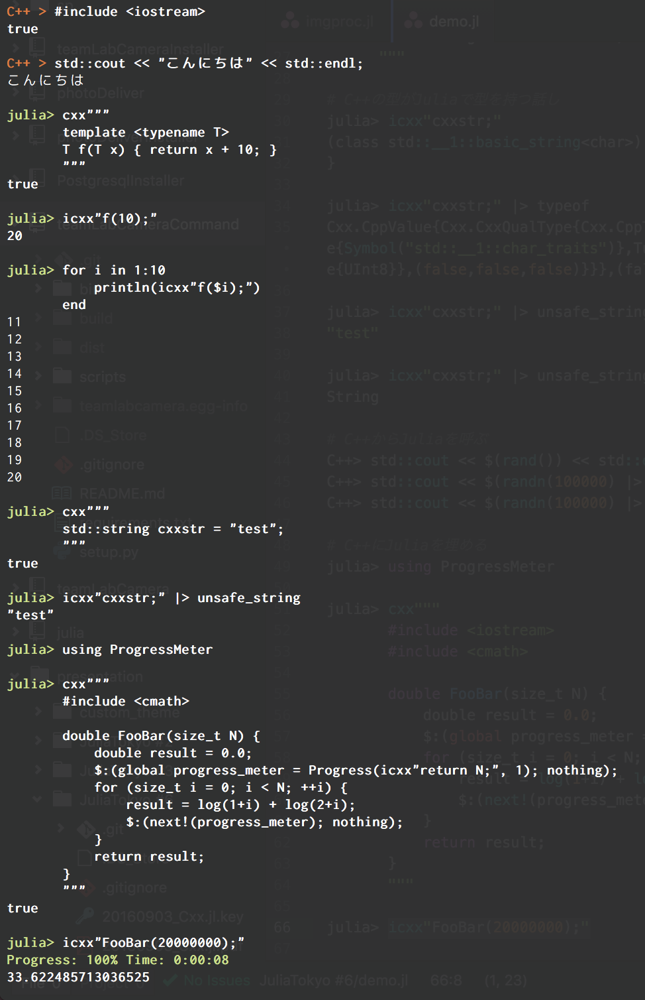

# JuliaTokyo6

## 資料PDF

[20160903_Cxx.jl.pdf](20160903_Cxx.jl.pdf)

## コード

### デモ用の覚え書き

[demo.jl](demo.jl)

### opencvを使った画像処理例

LTでは時間がなくて見せられませんでした

[imgproc.jl](imgproc.jl)

before

after

https://github.com/JuliaOpenCV/OpenCV.jl

###  PCLを使った点群データの可視化

これもLTでは時間がなくて見せられませんでした

[pcl.jl](pcl.jl)

https://github.com/JuliaPCL/PCL.jl
